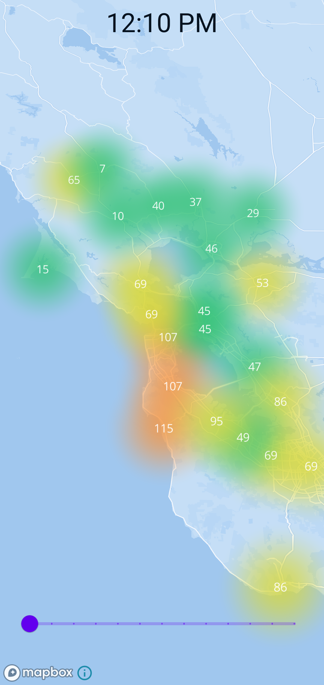
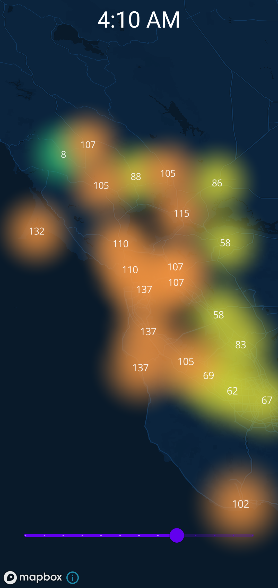

# BayAreaAirQuality
Simple air quality Android app for the bay area to play around with Android Architecture components

  
  

App architecture is inspired by Android proposed app architecture and the MVVM model.

This app has following packages:

1.  **data**: Contains static geodata.
2.  **di**: Dependency providing classes using Hilt.
3.  **db**: Database classes.
4.  **web**: Classes that deal with fetching, parsing and storing web data.
5.  **model**: Model classes used internally by the app to store data.
6.  **map**:  Classes that handle the transformations related to the map presentation
7.  **repositories**: Contains the Repository class
8.  **map**: Handles the mapbox map 

Technologies used:
- **Mapbox** to rendering and displaying the data as a live map
- **Kotlin Coroutines** to handle async code in a seamless way
- **Hilt** for dependency injection
- **LiveData** to update UI components
- **Room** to store air quality data
- **Retrofit** for api calls

Future additions:
- More unit tests
- Add more info to the map to improve UX